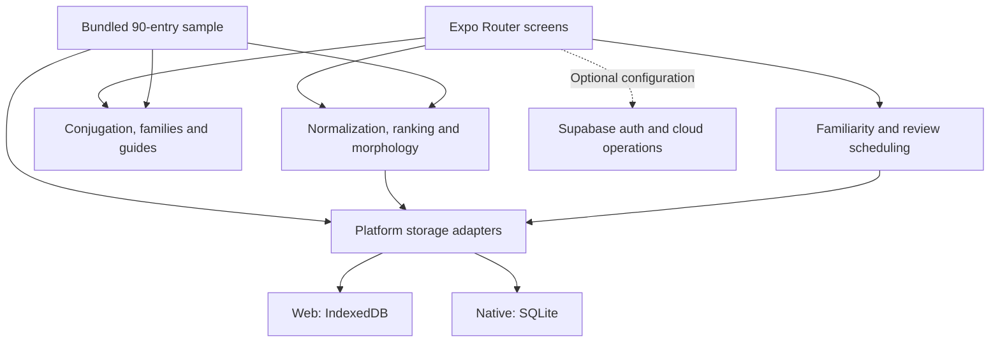
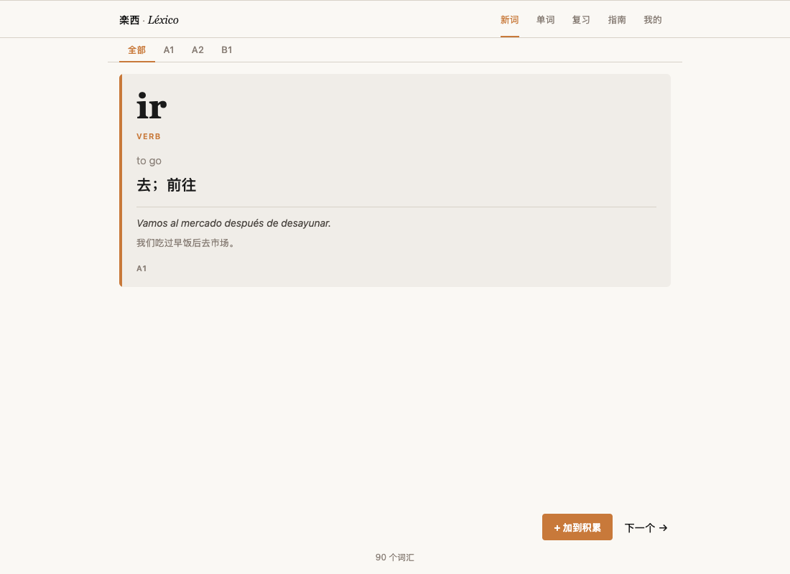
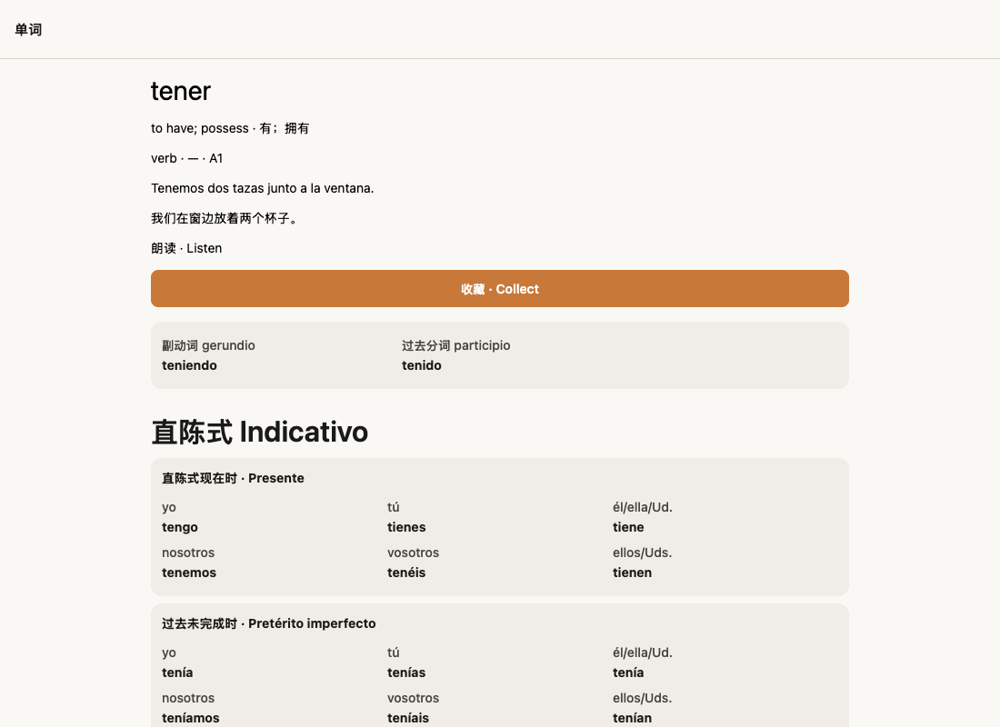

<div align="center">

# Léxico

**Look up a word. Understand its forms. Make it part of your vocabulary.**

A Spanish-learning application built with Expo, React Native and TypeScript.<br>
Spanish / English / Chinese lookup, morphology-aware search, conjugation,<br>
collections and spaced review — with **90 curated public sample entries**.

Live Demo: [Public sample edition](https://lexico-public.vercel.app) · [Screenshots](#screenshots) · [Run Locally](#run-locally) · [Data & Provenance](docs/DATA_PROVENANCE.md)

**Spanish · English · 中文** &nbsp; | &nbsp; **Local-first public sample**

</div>

> **Public portfolio edition.** This repository and its live demo use only the separately prepared 90-entry sample and run locally without a backend. The private working version was developed around a structured corpus of approximately 7,500 Spanish vocabulary entries; that corpus is not distributed here.

## What it does

- **Search in three languages:** look up Spanish words through Spanish, English or Chinese.
- **Find the form you encountered:** accent-insensitive matching, noun/adjective inflections and reverse verb conjugation.
- **Explore grammar in context:** conjugation tables, related word families, topic browsing and a compact guide.
- **Build a personal collection:** save words with a familiarity rating and return to scheduled reviews.
- **Start without an account:** the public sample runs locally without API keys or Supabase configuration.

## Why I built it

I wanted a vocabulary-learning workflow that combines multilingual lookup, grammar context and review instead of treating words as isolated flashcards. When I encounter an unfamiliar form, I want to find its base word, understand how it is used and save it for later—all within the same workflow.

## Why this project matters

A learner may know a meaning in English or Chinese, but encounter an accented word, a plural or a conjugated verb in Spanish. Connecting these entry points to the same vocabulary record makes the dictionary more useful than a literal headword search.

Léxico brings product design, language rules and data quality into one working application:

| Area | What the project demonstrates |
|---|---|
| **Product thinking** | A connected lookup → context → collection → review workflow. |
| **Search engineering** | Explicit normalization, ranking and morphology rules with inspectable behavior. |
| **Data quality** | Structured multilingual records, normalized uniqueness, valid references and regression checks. |
| **Responsible AI use** | AI-assisted preparation with editorial checks, provenance disclosure and deterministic runtime behavior. |

These are implementation goals and demonstrated capabilities, not claims of measured learning gains.

## Tech stack

| Layer | Technology |
|---|---|
| App & navigation | Expo **56.0.8**, Expo Router **56.2.8** |
| UI | React **19.2.3**, React Native **0.85.3** |
| Language | TypeScript **6.0.3** |
| Local storage | IndexedDB on web; SQLite adapter for native |
| Optional cloud | Supabase authentication and cloud data paths |
| Pronunciation | Installed local Spanish voices on web; platform TTS on native |

The code targets web, iOS and Android through Expo. **Local web behavior is validated; native-device parity and mobile release are not yet verified.**

## Architecture



`src/app` contains the screens, `src/components` the reusable UI, `src/data` the sample content, and `src/lib` the search, language, scheduling and storage logic.

Local review uses a deterministic SM-2-inspired scheduler: familiarity seeds the initial interval; later reviews update repetitions, ease and due dates. Time is passed into the scheduling functions, making their behavior reproducible.

## Multilingual search

Try these queries in the public sample:

| Input | Finds | How |
|---|---|---|
| `kitchen` / `厨房` | `cocina` | English or Chinese meaning lookup |
| `decision` | `decisión` | Accent-insensitive matching |
| `canciones` | `canción` | Noun plural mapping |
| `pequeñas` | `pequeño` | Adjective gender/number mapping |
| `trabajadoras` | `trabajador` | Explicit eligible noun counterpart and plural |
| `tengo` / `durmiendo` | `tener` / `dormir` | Reverse-conjugation lookup |

Spanish matching uses Unicode decomposition, accent removal and lowercase normalization. Candidate results are ranked by exact Spanish match, recognized inflection, Spanish prefix/substring, then English and Chinese matches; level and alphabetical ordering provide tie-breaks. The search screen also resolves recognized conjugations back to infinitives.

Feminine noun counterparts are explicitly restricted to eligible sample words rather than guessed from an `-o` ending. This avoids treating unrelated forms as feminine equivalents.

## Data preparation

**No LLM runs during normal app usage.** Search, morphology, conjugation and review scheduling use local code and structured data.

The development workflow explored Claude API tooling for content preparation and word-family suggestions. Those scripts **did not generate this approved 90-entry sample** and are excluded from this repository because their in-place writes and larger-corpus assumptions are unsuitable for the public edition.

The public sample was drafted separately with AI assistance, reference checking and user-approved editorial corrections. Deterministic checks validate its schema, normalized-headword uniqueness, gender/POS fields, family/topic references and search behavior. A provenance manifest records batch snapshots and final hashes. This is not independent human linguistic certification.

## Public sample edition

| Content | Included |
|---|---|
| Vocabulary | **90 records** — 41 A1, 30 A2, 19 B1 |
| Word classes | 29 nouns, 25 verbs, 16 adjectives, 8 adverbs, 12 other entries |
| Connections | **8 word families** and **4 topics** |
| Guide | **6 compact grammar cards** |

Definitions, examples and translations were prepared specifically for this edition. CEFR labels are **editorial classifications of selected senses/headwords**, not official certification; example sentences are illustrative and are not guaranteed to be fully level-controlled.

The larger private corpus is not distributed because its provenance/licensing review remains incomplete. No production credentials, private datasets or prerecorded audio are bundled. See [data provenance](docs/DATA_PROVENANCE.md), [the sample manifest](docs/SAMPLE_PROVENANCE.json) and [editorial review notes](docs/CONTENT_REVIEW.md).

## Testing

The public edition passed clean installation, TypeScript checking, Expo web export and automated checks for:

- All-record Spanish, accent-normalized, English and Chinese search; selected prefix, inflection and reverse-conjugation cases.
- Valid feminine mappings and rejection of false counterparts, plus conjugation fixtures.
- Schema integrity, duplicate detection, reference resolution and preservation of the original ten pilot records.
- Local review persistence and mocked cloud success/failure paths.
- No-environment startup without creating a Supabase client.

Headless Chrome checks also covered collection and review persistence after reload, local missing-word reports, and topic/guide/detail routes. No external HTTP requests were attempted during those local-mode flows. The hosted public sample also passed Chrome checks for direct-route navigation, mobile layout and two-card review persistence after reload, with no page errors or unexpected external HTTP requests in the tested flows. Live Supabase and native-device behavior remain unverified.

<details>
<summary><strong>Run the checks</strong></summary>

```sh
npx tsc --noEmit
npm run test:conjugation
npm run test:morphology
npm run test:review
npm run test:pilot
npm run test:sample
node scripts/local-mode-sanity.cjs
npx expo export -p web
node scripts/isolation-check.cjs
node scripts/serve-export.cjs
```

Browser checks use `scripts/browser-smoke.cjs` with separately installed Playwright and Chrome. Set `PLAYWRIGHT_MODULE` if Playwright is external, and `PILOT_ORIGIN` to the running local server.

Run the browser smoke script against the local static preview to cover exported routes. The isolation script scans public source and export files while excluding Git metadata and dependencies; bundle inspection verifies exactly 90 vocabulary objects matching the approved sample.

</details>

## Run locally

Use Node **22.18+** and npm:

```sh
git clone https://github.com/DoroMego/lexico.git
cd lexico
npm ci
npm run web
```

**No `.env`, backend account or API key is required.** Collections, reviews and missing-word reports stay in this browser/device in default mode. Clearing local storage may remove them. Sample-specific storage names isolate this edition from development data.

<details>
<summary><strong>Optional Supabase configuration</strong></summary>

Copy `.env.example` to `.env` and supply your own `EXPO_PUBLIC_SUPABASE_URL` and `EXPO_PUBLIC_SUPABASE_KEY`. Public environment variables must never contain private or service-role keys.

You must provision and review your own schema, constraints and RLS; migrations are not included. `EXPO_PUBLIC_ADMIN_USER_ID` is a UI hint, not backend authorization. Hosted audio requires explicit `EXPO_PUBLIC_ENABLE_AUDIO=true` and independently provisioned assets with appropriate rights. Default web pronunciation selects only installed local Spanish voices; if none is available, pronunciation is unavailable rather than falling back to a network voice. Native platform TTS behavior is not verified.

Optional cloud features send data to your configured Supabase project. Local mode makes no Supabase requests and shows this device's reports only.

</details>

## Screenshots

All screenshots below are captured from this repository's **90-entry public sample**, served locally from its static export.



| Multilingual lookup | Conjugation |
|---|---|
|  |  |


Additional views: [word detail](docs/images/public-word-detail.png) · [sample guide](docs/images/public-guide.png).

## Limitations

- The sample is deliberately small; morphology rules and selected conjugation fixtures are not exhaustive linguistic coverage.
- Native-device parity, live cloud integration and mobile release remain unverified; cloud integration is not full bidirectional sync.
- Local and configured web-cloud review scheduling differ. Browser check-ins are incomplete; failed cards become due immediately but are not requeued within the same session.
- Independent human linguistic review and broader language edge-case coverage remain future work.

`npx expo export -p web` produces a static web export. Vercel configuration serves route-specific static HTML using clean URLs. Sample word, topic and guide routes are generated at build time; no homepage catch-all rewrite is used. The export passes local preview checks and hosted verification on the public sample demo. Configure that project with no Supabase/audio environment variables for the default local-only demo.

## License / provenance

Code is [MIT licensed](LICENSE), retaining the existing Expo notice. Original expressive sample content and curated organization are offered under [CC BY 4.0](LICENSE-CONTENT), to the extent applicable rights are held. Ordinary Spanish words and grammatical facts are not claimed as proprietary.

Read [DATA_PROVENANCE.md](docs/DATA_PROVENANCE.md) for authorship, review scope and the distinction between the public sample and private corpus.
